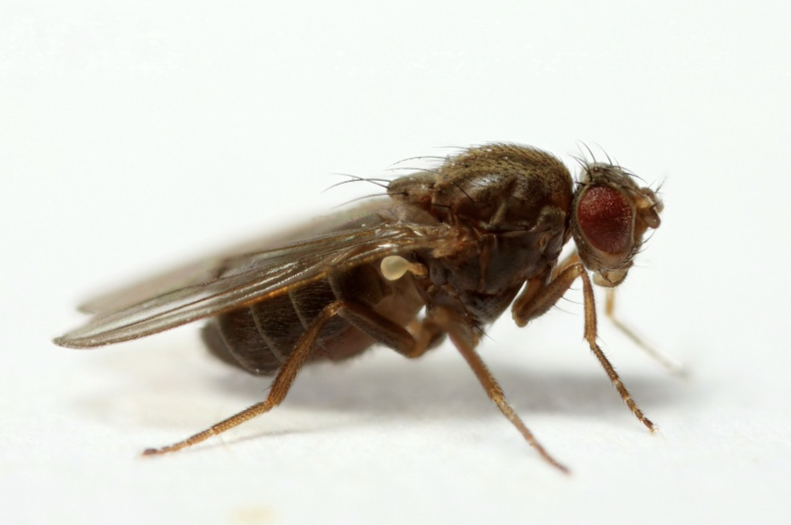
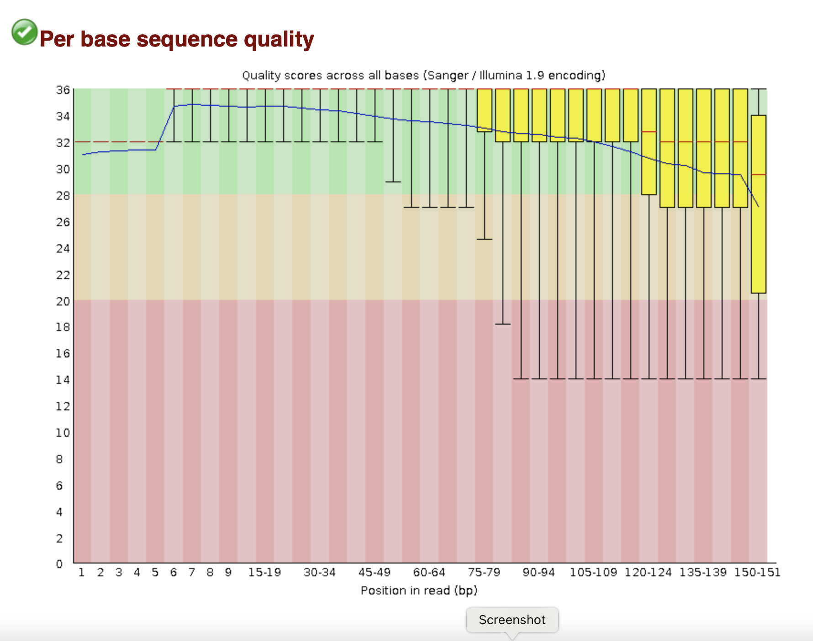
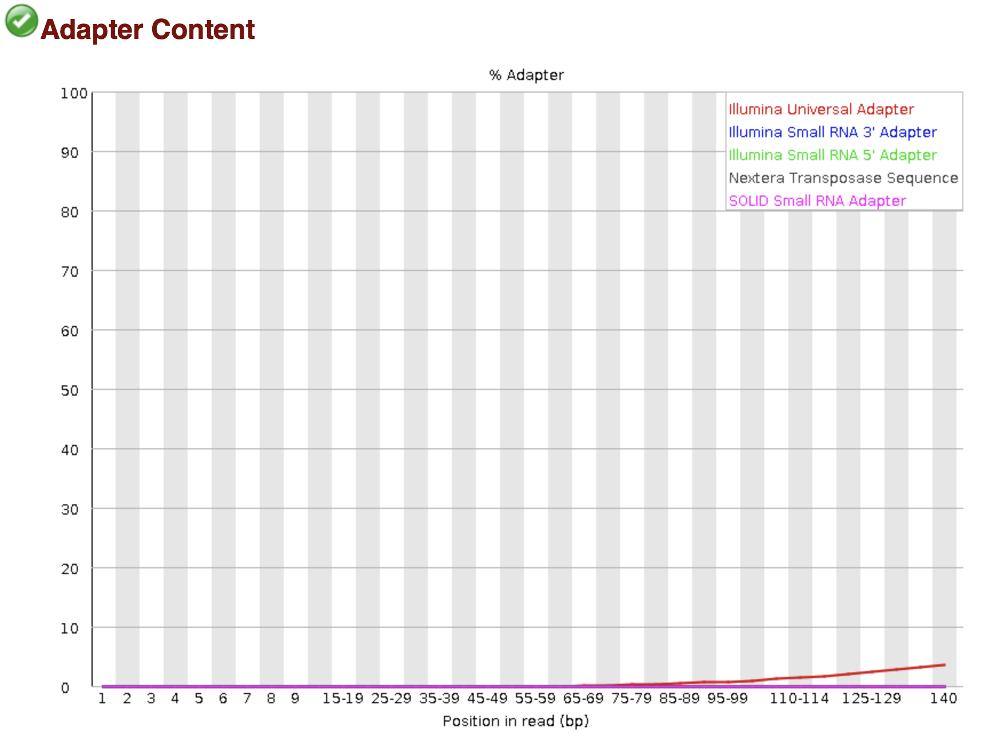
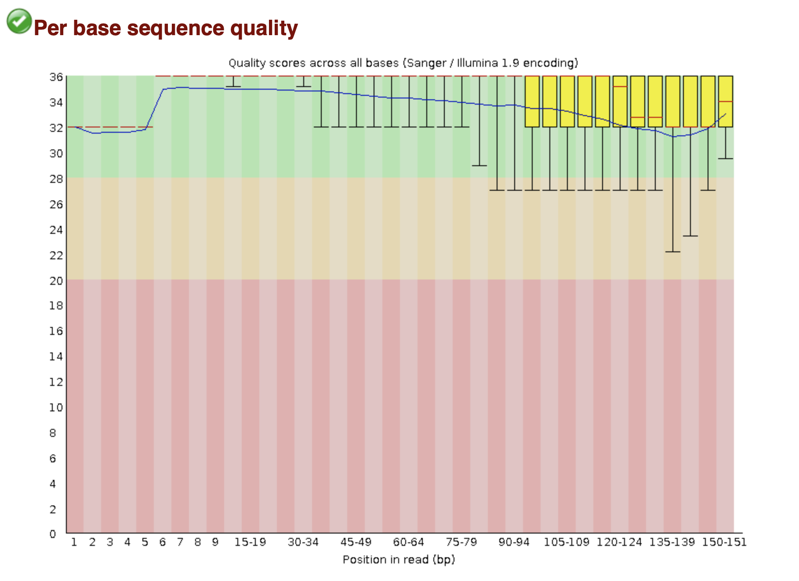
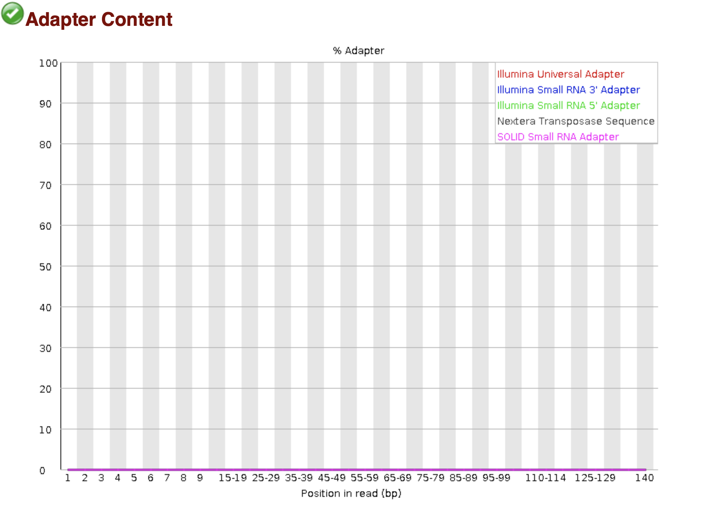
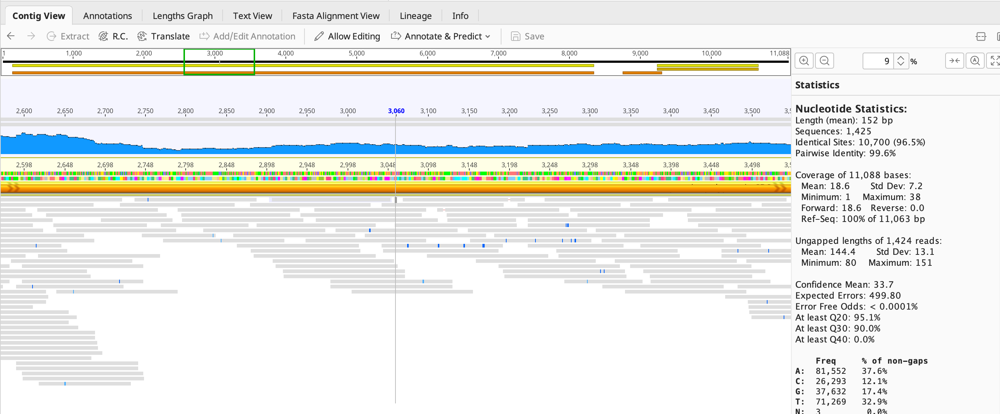
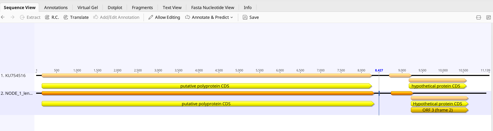
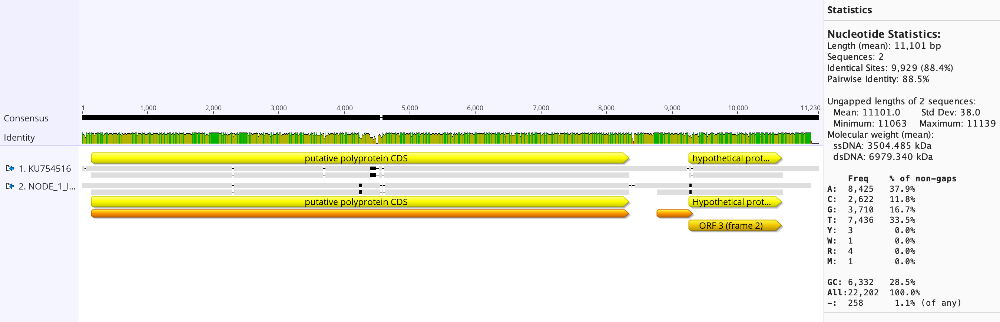

##  MIP 280A4 Final Project 2022

This report documents the final project I did for MIP 280A4, Microbial Sequence Analysis, in the fall of 2022.

It is written in [Markdown format](https://www.markdownguide.org/basic-syntax/).  

## Virus Hunting with Drosophila virilis

 *photographed by Darren J. Obbard*


For this project, I worked with a dataset derived from total RNA of pooled *Drosophila virilis* (males or females) from the Stenglein lab. Libary preparation and sequencing were performed by Tillie Dunham and Kai Chase. Wild-caught Drosophila virilis were pooled for sequencing. The run was performed using an Illumina NextSeq 500 with single-end 150 bp reads.
The goal of this project was to discover if there were virus reads present in the sequencing data. Briefly, sequencing reads were mapped to the *D. virilis* genome. Unmapped reads, where one might expect to find viral reads, were assembed using SPAdes, and the contigs from this assembly were analyzed using NCBI's BLASTn database and alogrithm. All work for this project is located on the thoth01.cvmbs.colostate.edu server. 


## Step 1: Create a clone of the repository on github
I created an account on github and then created this report to document the workflow and analysis for this project:

I cloned the repository using the following command:
```
kjreed@thoth01:~$ git clone https://github.com/kjreedseq/2022_MIP_280A4_final_project.git
```
While in the 2022_MIP_280A4_final_project repository on thoth01, I created a file to record my workflow and data, called nano_report.md and then cloned it on github:
```
kjreed@thoth01: ~/2022_MIP_280A4_final_project$ touch nano_report.md
```
Then the process of uploading it to the github repository was started, using the ```git add``` command:

```
kjreed@thoth01:~$ git add nano_report.md
```
The report was committed with the ```git commit``` command, with a -m argument so that the comment for the upload could be added simultaneously.
```
kjreed@thoth01:~$ git commit -m "adding nano_report.md"
```
While committing, the comment was added in the command line. 
The next step was to publish the file on github using ```git push origin main```
```
kjreed@thoth01:~$ git push origin main
```
 
## Step 2: **Download fasta file of Drosphila virilis**

1. I navigated to the 2022_MIP_280A4_final_project folder (/home/kjreed/2022_MIP_280A4_final_project on the thoth01.cvmbs.colostate.edu server.
2. I then located the reference genome on NCBI via a web browser.
3. The file was downloaded directly, using the curl software, to the repository on thoth01 using:
```
curl -OL https://ftp.ncbi.nlm.nih.gov/genomes/all/GCF/003/285/735/GCF_003285735.1_DvirRS2/GCF_003285735.1_DvirRS2_genomic.fna.gz
```
The file containing the compressed fasta file was directly upload to the final project directory.


## Step 3: FastQC

1. The data file for the *D. virilis* sequencing run was copied from the thoth01 server:
```
kjreed@thoth01: /home/data_for_classes/2022_MIP_280A4/final_project_datasets$ \
cp FoCo_virilis_R1.fastq  ~/2022_MIP_280A4_final_project
```
2. The conda environment was activated using:
```
kjreed@thoth01:~$ conda activate bio_tools
```

This puts the directories for the software tools in my PATH.

3. The FoCo_virilis_R1.fastq file was analyzed for quality using FastQC:
``` 
kjreed@thoth01:~/2022_MIP_280A4_final_project$ fastqc FoCo_virilis_R1.fastq 
```




FastQC generates html files that show graphically important statistics regarding the overall quality of the run. The number of reads from the sequencing run was 1,616,192. The quality score for the reads was >30 for reads that were under 130bp. Above this, the quality score dropped to <30 and at 150 bp it was nearly Q=20. The average quality score was 34. There was a significant amount of PCR duplicates among the reads. Adapter sequences were present, so it was necessary to trim the ends of the reads to remove them. If not trimmed, reads with these adapter sequences won't map. I moved the FastQC files to my laptop from the thoth01 server using Cyberduck. 

## Step 4: Trim Adapters

Since there is adapter content in the reads that must be removed prior to moving forward with the worflow, I used the following command to trim the adapters from the fastq file:
```
kjreed@thoth01:~/2022_MIP_280A4_final_project$ \
cutadapt \
 -a AGATCGGAAGAGC \
 -q 30,30 \
 --minimum-length 80 \
 -o FoCo_virilis_R1_trimmed_fastq \ 
 FoCo_virilis_R1_fastq | tee cutadapt.log
```
Cutadapt created a new fastq file, "FoCo_virilis_R1_trimmed_fastq", that will be used to map against the reference genome.

## Step 5: Confirm QC
I ran FastQC again on the trimmed reads. The FastQC report was assessed on the web browser as before.





After trimming, the dataset contained 1,428,938 reads. Adapter content was reduced to 0%. The Q score improved slightly.

## Step 6: Create an index of the genome

Using bowtie2, I created an index of the genome using the following command:

```
kjreed@thoth01:~/2022_MIP_280A4_final_project$ \
 bowtie2-build \
 --threads 8 \
 GCF_003285735.1_DvirRS2_genomic.fna  DvirRS2_genomic_index
```

This created a set of indexes that will increase the speed at which assembly can be processed by the computer.

## Step 7: Map reads to reference genome

Using bowtie2, reads were mapped to the reference sequence using the following command:

```
kjreed@thoth01:~/2022_MIP_280A4_final_project$ \
bowtie2 -x DvirRS2_genomic_index \
 -U FoCo_virilis_R1_trimmed_fastq \
 --no-unal \
 --threads 8 \
 -S FoCo_virilis_R1_mapped_to_DvirRS2.sam \
 --un FoCo_virilis_R1_not_mapped_fastq
```
Unmapped reads were put in a separate file, "FoCo_virilis_R1_not_mapped_fastq", and this file was used to perform an assembly of contigs that did not map to the *D. virilis* genome.
 
**Results from bowtie2:**
	1428938 (100.00%) were unpaired; of these:
	60427 (4.23%) aligned 0 times
	1184 (0.08%) aligned exactly 1 time
	1367327 (95.69%) aligned >1 times
	95.77% overall alignment rate

There is a 95.77% overall alignment to the reference genome, most of which aligned > than 1 time. The multiple alignments are likely due to the use of total RNA as the source for this data. These reads are probably mRNA and rRNA from the host. 4.23% of reads that did not align at all to the reference and these are the reads that are most interesting - perhaps there are viral sequences there! 

## Step 8: Assemble unmapped reads

Assembly was performed using SPAdes with the following command: 

```
kjreed@thoth01:~/2022_MIP_280A4_final_project$ \
 spades.py -o FoCo_virilis_R1_spades_assembly \
  -s FoCo_virilis_R1_not_mapped.fastq \
  -m 24 -t 48

````
Note: I had to change the fastq file name to ".fastq" from "_fastq" to run this program.
This created a new directory called FoCo_virilis_R1_spades_assembly.
Inside this directory were fasta files for the contigs and the scaffolds. In this workflow, I only worked with the contigs.fasta file.

## Step 9: Make a new file with largest 12 contigs

To analyze the 12 largest contigs of the unmapped reads, I took the first 24 lines (12 contigs of unpaired reads, 2 lines each) and created a new fasta file, "first_12_contigs.fasta"using seqtk:
```
kjreed@thoth01: ~/2022_MIP_280A4_final_project/FoCo_virilis_R1_spades_assembly$ \ 
 seqtk seq -A contigs.fasta  |head -24 >first_12_contigs.fasta
```

## Step 10: BLAST hits and analyze

Once the new file with only the 12 largest contigs was created, I opened the file using the cat command:
```
kjreed@thoth01:~/2022_MIP_280A4_final_project/FoCo_virilis_R1_spades_assembly$ cat first_12_unmapped_contigs.fasta 
```
I copied the contents of the file on the terminal screen. After opening BBedit on my laptop, I pasted the file onto a blank document and saved to my computer. I copied the contents again, and used this as the input to the BLASTn search
(https://blast.ncbi.nlm.nih.gov/Blast.cgi) on a web browser

The BLAST search parameters were kept at default.

The table below shows the top hits of the 12 contigs that were analyzed:

| Contig  | Length | Hit                                                                               | Query Coverage | E value | Percent ID | Interpretation                                                                                                                                                                                               |
|---------|--------|-----------------------------------------------------------------------------------|----------------|---------|------------|--------------------------------------------------------------------------------------------------------------------------------------------------------------------------------------------------------------|
| NODE 1  | 11063  | Buckhurst virus putative polyprotein and hypothetical protein genes, complete cds | 99%            | 0.0     | 90.36%     | next best hit has 70% query coverage (Beult virus)                                                                                                                                                           |
| NODE 2  | 5167   | Hubei  virga-like virus                                                           | 33%            |   8e-73 | 66.07%     | other hits are viruses as well, with better % ID and are viruses found in insects when changing BLAST parameters to more ambiguous                                                                           |
| NODE 3  | 4695   | RdRp Hubei  virga-like virus 9                                                    | 77%            |  4e-170 | 31.64      | RNA-dependent RNA polymerase, Riboviria family                                                                                                                                                               |
| NODE 4  | 4650   | non-coding RNA from Drosphila miranda                                             | 90%            | 0.0     | 94.47%     | highly conserved RNA from Drosophila                                                                                                                                                                         |
| NODE 5  | 3053   | Drosophila subobscura small subunit ribosomal RNA                                 | 22%            | 0.0     | 100%       | highly conserved RNA from Drosophila, shared with multitude of species                                                                                                                                       |
| NODE 6  | 2542   | Drosophila pseudoobscura large subunit ribosomal RNA                              | 97%            | 0.0     | 100%       | highly conserved RNA from Drosophila, shared with multitude of species                                                                                                                                       |
| NODE 7  | 1859   | Brettanomyces nanus mtDNA                                                         | 99%            | 0.0     | 81.51%     | yeast; isolated from beer, 50X coverage; interestingly, 2nd hit is for Pichia kudriavzevii strain CY902 mitochondrion, complete genome. This has 98% query coverage and a higher % identity. 3000X coverage. |
| NODE 8  | 1676   | Drosophila persimilis uncharacterized LOC6596633 (LOC6596633), mRNA               | 100%           | 0.0     | 99.52%     | mRNA from Drosphila                                                                                                                                                                                          |
| NODE 9  | 1671   | Drosophila pseudoobscura uncharacterized LOC117183405 (LOC117183405), ncRNA       | 100%           | 0.0     | 94.28%     | non-coding RNA from Drosphila                                                                                                                                                                                |
| NODE 10 | 1653   | Drosophila pseudoobscura uncharacterized LOC117183405 (LOC117183405), ncRNA       | 99%            | 0.0     | 93.91%     | non-coding RNA from Drosphila                                                                                                                                                                                |
| NODE 11 | 1645   | Hanseniaspora uvarum mitochondrion, complete genome                               | 100%           | 0.0     | 99.27%     | another yeast that hangs out on grapes                                                                                                                                                                       |
| NODE 12 | 1481   | Acetobacter orientalis FAN1 DNA, complete genome                                  | 98%            | 0.0     | 98.50%     | bacteria associated with fruits, originally isolated from yogurt                                                                                                                                             |

*This table created using Tables Generator.* The first three contigs were most similar to viruses while the remaining contigs matched closely with host RNA, yeast and bacteria. The first hit, Buckhurst virus putative polyprotein and hypothetical protein genes, complete cds, had 99% query coverage and about 90% percent identity. An E value of 0.0 leads me to believe that this hit is valid.

The second and third contigs did not have any hits using BLASTn, but did have matches when I used BLASTx. For both contigs, the closest match was a Hubei virga-like virus. This virus is under the alphavirus genus. It is a +ssRNA virus and is found in Drosophila species. The only accession in GenBank was entered in 2016 and was isolated from * D. obscura* in the UK.
 
## Step 11: Remap 

To ensure that the unmapped contigs made sense, remapping was performed. Because the viral hits from BLAST were in the first three contigs, a new index as built using only these first three contigs using the following command:

```
kjreed@thoth01:~/2022_MIP_280A4_final_project/FoCo_virilis_R1_spades_assembly$ \
  bowtie2-build first_3_contigs.fasta \
  --threads 24 viral_contigs_index
```
This command created a new index of just the first three contigs. Then, the viral contigs (contigs 1, 2, and 3) were mapped against the fastq file of the reads that did not align to the host genome ("FoCo_virilis_R1_not_mapped_fastq"):
```
kjreed@thoth01:~/2022_MIP_280A4_final_project/FoCo_virilis_R1_spades_assembly$ \
 bowtie2 -x viral_contigs_index \
  -U ../FoCo_virilis_R1_not_mapped_fastq \
  --no-unal --threads 24 \
  -S viral_contigs_mapped_to_unmapped_FoCo_virilis.sam \
  --un viral_contigs_not_mapped.fastq
```

Results from this mapping are as follows:
  60427 reads; of these:
  60427 (100.00%) were unpaired; of these:
    58284 (96.45%) aligned 0 times
    2143 (3.55%) aligned exactly 1 time
    0 (0.00%) aligned >1 times
3.55% overall alignment rate 

So, of the 4.23% of reads that did not align to the host genome in the first assembly, only 3.55% of *those* reads aligned to the contigs 1-3. Only 2143 of the 1.6 million reads generated resulted in algnments to these contigs. 

## Analysis of contigs in Geneious

Using Cyberduck 8.4.5, I transferred the  first 3 contigs as a fasta file (built using seqtk) and the sam file of the viral contigs mapped to it.
I dropped the fasta file into Geneious first, then the sam file. I also pulled the GenBank accession.



Average coverage over the first contig is 18.6X, with the lowest coverage being 1X. Pairwise identity is 99.6%, suggesting that the assembly is valid.
In comparison with the GenBank accession, the first contig covers almost the entire length of the virus sequence, 
with 11,063 bases in the contig and 11,139 bases in the accession - very good!


There are a couple of ORFs in the virus and these match up well with the accession in GenBank.



Looking closely at the reads against the consensus sequence, there does not appear to be any SNVs. Nucleotide changes are sporadic and appear to be sequencing errors. Coverage is not particularly high, so variants cannot be ruled out.
A pairwise alignment (global, Needleman-Wunsch with 70% similarity) of the GenBank accession with the contig 1 fasta file shows and 88% Pairwise Identity




## Software used for this project:

| Software Used | Version  |
|---------------|----------|
| FastQC        |   0.11.9 |
| bowtie2       |    2.4.5 |
| SPAdes        |   3.15.5 |
| samtools      |     1.14 |
| cutadapt      |      3.5 |
| curl          |   7.85.0 |
| seqtk         |      1.3 |
| Cyberduck     | 8.4.5    |

*This table created using Tables Generator.*
